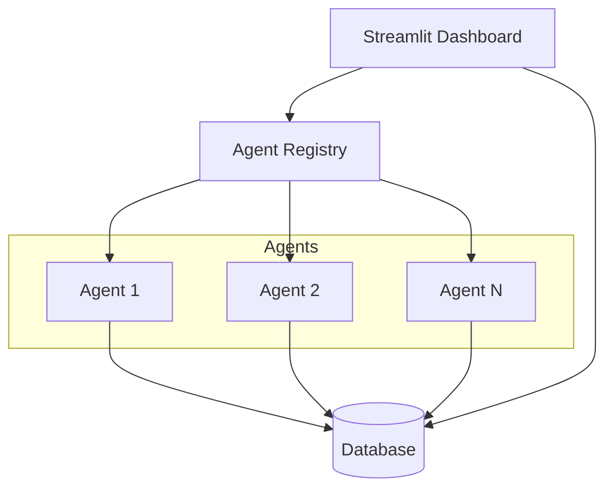

# HiveSec Ecosystem Hub — AI Security Dashboard

[](LICENSE)
[](https://www.python.org)
[](https://streamlit.io)
[](https://github.com/GBOYEE/HiveSec-Ecosystem-Hub/actions)
[](https://codecov.io/gh/GBOYEE/HiveSec-Ecosystem-Hub)

**Security monitoring for AI agent fleets.** Centralized dashboard to discover agents, run scans, track vulnerabilities, and maintain audit trails across your entire autonomous ecosystem.

<p align="center">
  
</p>

## ✨ Features

- 🔍 **Agent Auto-Discovery** — Automatically finds agents from `agents/` folder
- 🛡️ **Unified Findings Store** — SQLite (dev) or Postgres (prod) for scan results
- 🧪 **Pluggable Scanners** — Add new security agents by dropping Python files
- 📊 **Real-Time KPIs** — Alert counts, agent status, trends
- 🔬 **Scan Monitoring** — Launch scans, watch progress, view detailed results
- 📜 **Audit Trails** — Full logging for compliance and forensics
- 🐳 **Docker Ready** — Compose setup with optional Postgres

## 🚀 Quick Start

```bash
git clone https://github.com/GBOYEE/HiveSec-Ecosystem-Hub.git
cd HiveSec-Ecosystem-Hub
pip install -r requirements.txt
streamlit run Home.py
```

Open: http://localhost:8501

Or with Docker:
```bash
docker compose up -d
```

## 🏗️ Architecture



Agents auto-discovered from `agents/` folder. Each implements:
```python
def name() -> str: ...
def scan(target: str) -> List[Finding]: ...
def metadata() -> dict: ...
```

See [docs/architecture.md](docs/architecture.md).

## 📦 Tech Stack

| Layer | Technology |
|-------|------------|
| UI | Streamlit |
| Language | Python 3.11+ |
| Database | SQLite (dev) / PostgreSQL (prod) |
| Cache | Redis (optional) |
| Agents | Pluggable Python modules |

## 🧪 Testing & CI

```bash
pytest tests/ -v --cov=hivesec
```

CI runs on push: lint, tests, coverage.

## 📚 Documentation

- [Getting Started](docs/README.md)
- [Agent Development Guide](docs/agent-dev.md)
- [API Reference](docs/api.md)
- [Contributing](CONTRIBUTING.md)

## 🎯 Roadmap

- [ ] OAuth2 authentication for dashboard
- [ ] Advanced filtering & saved searches
- [ ] Email/Slack notifications for critical findings
- [ ] Multi-tenant support
- [ ] Agent marketplace (publish/share scanners)

## 🤝 Contributing

Add new security agents! Create `agents/my_scanner.py` implementing the `scan()` interface and submit a PR.

See [CONTRIBUTING.md](CONTRIBUTING.md) for guidelines.

## 📄 License

MIT — see [LICENSE](LICENSE).

---

<p align="center">
Built by <a href="https://github.com/GBOYEE">Oyebanji Adegboyega</a> • 
<a href="https://gboyee.github.io">Portfolio</a> • 
<a href="https://twitter.com/Gboyee_0">@Gboyee_0</a>
</p>
