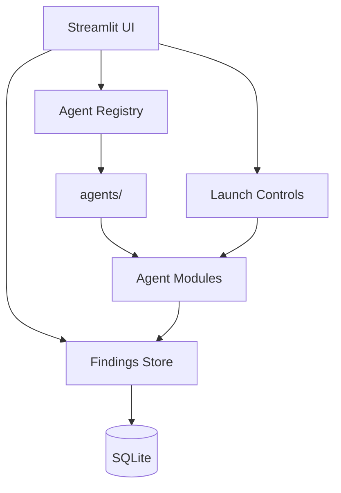

# HiveSec Ecosystem Hub

> Streamlit control tower for your AI security agents. One pane to launch scans, view findings, and monitor the Hive.

[](https://python.org)
[](LICENSE)
[](.github/workflows/ci.yml)
[](https://gboyee.streamlit.app/HiveSec-Ecosystem-Hub)

## Problem

You’ve built multiple AI security agents (vuln scanners, aligners, monitors). Running them in separate terminals means:
- No unified view of alerts
- Manual orchestration across agents
- Hard to correlate findings and prioritize

## Solution

HiveSec Ecosystem Hub is a Streamlit dashboard that:

- **Auto‑discovers agents** in the `agents/` folder via a simple plugin system
- Shows **KPI cards**: alerts today, active agents, critical CVSS count
- **Launch scans** and watch progress in real time
- Stores findings in a shared SQLite/Postgres backend
- Provides drill‑down views for each agent’s report

Result: One command (`streamlit run Home.py`) gives you a live security operations center for your AI agents.

## Features

- Agent registry — drop a new agent module into `agents/` and it appears
- Real‑time KPI dashboard
- Unified findings store (SQLite)
- Scan launch controls and progress
- Extensible UI components per agent

## Quickstart

```bash
# 1. Clone and install
git clone https://github.com/GBOYEE/HiveSec-Ecosystem-Hub.git
cd HiveSec-Ecosystem-Hub
pip install -r requirements.txt

# 2. Run the dashboard
streamlit run Home.py

# 3. Open http://localhost:8501
```

## Screenshots


_Figure: Top‑level KPI cards and recent alerts_


_Figure: Drill‑into a specific agent’s findings_

## Architecture



## Adding a New Agent

1. Create `agents/my_agent.py` implementing:
   - `name() -> str`
   - `scan(target: str) -> List[Finding]`
   - `metadata() -> dict`
2. Restart dashboard — auto‑registers.

See `agents/EXAMPLE_AGENT.py` for a template.

## Development

```bash
# Hot reload
streamlit run Home.py --server.runOnSave true
```

Tests (minimal):

```bash
pytest -q
```

## Production

- Deploy on Streamlit Community Cloud or your VPS
- Set `DATABASE_URL` for Postgres (recommended for multi‑user)
- Enable authentication via Streamlit secrets if needed

## Roadmap

- [ ] Role‑based access control
- [ ] Webhook alerts to Slack/Telegram
- [ ] Correlated attack chain view
- [ ] Agent health metrics

## License

MIT. See [LICENSE](LICENSE).
