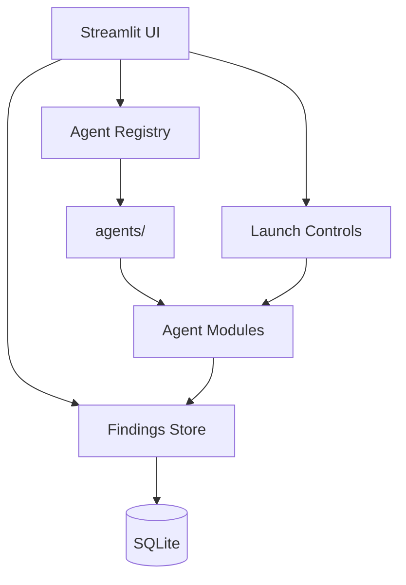

# HiveSec Ecosystem Hub

> Streamlit control tower for your AI security agents. One pane to monitor, launch, and review findings across all your security tools.

[](https://python.org)
[](LICENSE)
[](.github/workflows/ci.yml)
[](https://gboyee.streamlit.app/HiveSec-Ecosystem-Hub)

## Problem

You’ve built multiple AI security agents (vuln scanners, aligners, monitors). Running them individually means:
- No unified view of findings
- Manual orchestration across agents
- Hard to correlate alerts and prioritize

## Solution

HiveSec Ecosystem Hub is a Streamlit dashboard that:
- Registers all HiveSec agents via a simple plugin system
- Provides KPI cards (alerts today, active agents, critical CVSS)
- Lets you launch scans, view results, and drill into reports
- Stores findings in a shared SQLite/Postgres backend

Result: One command (`streamlit run Home.py`) gives you a live security operations center for your AI agents.

## Features

- **Agent registry** — Auto‑discovers agents in `agents/` folder
- **Real‑time KPI dashboard** — Alerts, agents status, trends
- **Unified findings store** — SQLite + optional Postgres
- **Launch & monitor** — Trigger scans and watch progress
- **Extensible** — Drop a new agent module in `agents/` and it appears

## Quickstart

```bash
# 1. Clone and install
git clone https://github.com/GBOYEE/HiveSec-Ecosystem-Hub.git
cd HiveSec-Ecosystem-Hub
pip install -r requirements.txt

# 2. Run the dashboard
streamlit run Home.py

# 3. Open http://localhost:8501 in your browser
```

## Screenshots


_Figure: Top‑level KPI cards and recent alerts_


_Figure: Drill‑into a specific agent’s findings_

## Architecture



## Adding a New Agent

1. Create `agents/my_agent.py` with a `MyNewAgent` class implementing:
   - `name() -> str`
   - `scan(target: str) -> List[Finding]`
   - `metadata() -> dict`
2. Restart the dashboard — it auto‑registers.
3. Optionally add an icon to `assets/icons/` and update `AGENTS.md`.

See `agents/EXAMPLE_AGENT.py` for a template.

## Development

```bash
# Run with hot‑reload
streamlit run Home.py --server.runOnSave true
```

Tests (minimal sanity checks):

```bash
pytest -q
```

## Production Deployment

- Deploy on Streamlit Community Cloud (free) or your own VPS.
- Set `DATABASE_URL` for Postgres (recommended for multi‑user).
- Enable authentication via Streamlit secrets if needed.

## Roadmap

- [ ] Role‑based access control
- [ ] Webhook alerts to Slack/Telegram
- [ ] Correlated attack chain view
- [ ] Agent health metrics (runtime, memory)

## License

MIT. See [LICENSE](LICENSE).
